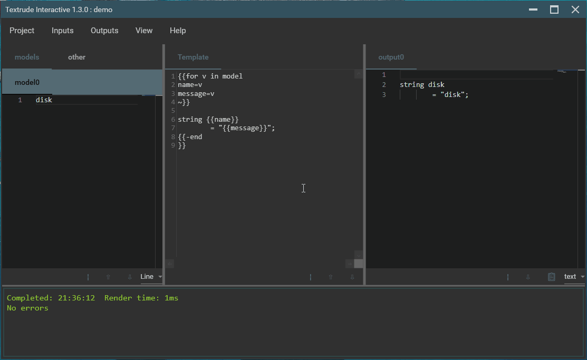

# 

 

## Give a Star! :star:

If you like or are using this project please give it a star or leave some feedback in the [discussions](https://github.com/NeilMacMullen/Textrude/discussions/categories/send-a-smile) section. A little feedback goes a long way - thanks!

## What is it?

Textrude is a tool to feed CSV,YAML, JSON or plain-text files into [Scriban](https://github.com/scriban/scriban) templates. That makes it useful for:
 - **Code-generation**. Generate serializers, smart-enums, lookup tables etc from structured data
 - **Quick and dirty data-processing**. Pull a json file from a URL and extract the fields you're interested in.
 - **Text processing**. Use line mode to filter the contents of large log files to get to the relevant sections 

Textrude comes in 3 flavours:
- **textrude.exe** is a Windows CLI tool for use from the console and within build-systems
- **textrude_linux** as above but for Linux
- **TextrudeInteractive** is a Windows UI tool for rapid prototyping and development of models and templates.

## Why use it?

For **code-generation**, Textrude's strengths are:
- Easy model (data) creation - use CSV for simple lists or YAML/JSON if you need structured data
- Low-ceremony syntax while retaining a fully functional programming language
- Supports multiple input models and multiple output files for a single template
- Easy to inject additional model context via environment variables or user-supplied definitions
- Built-in dependency checking integrates well with your build system and avoids unneccesary rebuilds
- Support for template re-use/libraries
- Real-time prototyping tool  (TextrudeInteractive)

For **text-processing** or **data-processing**
- Scriban is an easy to understand but relatively powerful scripting language
- **TextrudeInteractive** provides *immediate* feedback so you can see how the input is being processed by your script
- You can pipe text into **Textrude** from another command and reuse the templates you developed in **TextrudeInteractive** to shape the output
- **Textrude** can even pull JSON directly from a URL and feed it through a template.

## Download/build

The current release is **v1.5.0**.

**Textrude requires [.Net 5.0](https://dotnet.microsoft.com/download/dotnet/5.0).  If it's not already on your machine you will be prompted to install it.**

**To run TextrudeInteractive v1.3 and up you must install the [WebView2 runtime](https://developer.microsoft.com/en-us/microsoft-edge/webview2/)**

 - If you just want the binaries,  [go here](doc/getBinaries.md).
 - Alternatively, [building from source](doc/buildFromSource.md) is pretty easy and gives you access to the bleeding-edge! 
 - Or you can create a [Docker image](Docker.md)

## What's new

### vNext (source only)
- Reduce annoying visual flicker when resizing edit panes
- Integers larger than 32 bits supported in JSON files 
- textrude.exe now provides a convenient [pipe](doc/cmdPipe.md) command
- textrude.exe *render* command now offers a *verbose* option
- textrude.exe *info* command now shows full application path
- textrude.exe now supports [dynamic output](doc/dynamicOutput.md)
   

### v1.5.0 (source/binary)
- Textrude now provides some simple [syntax extensions](doc/syntaxExtensions.md) over *classic* Scriban 
- A [create_library](doc/userLibrary.md) built-in method is now provided to make it easier to create libraries
- LoopLimit now removed and cancellation of long-running in-flight renders is supported.  This makes it easier to process large text files.
- **Textrude** can now read models from STDIN or from a URL, making it useful for processing the output of other commands.
- **Textrude** model/output specifiers can now include explicit format declarations.

[Full change history](doc/changeHistory.md)

## Documentation

- [Getting started with template generation](doc/gettingStarted.md)
- [Extended Scriban syntax](doc/syntaxExtensions.md)  
- [Built in helpers](doc/builtIns.md)
- [Library functions](doc/lib.md)
- [Environment variables and user-definitions](doc/environmentAndDefinitions.md)
- [Multiple models and/or output files](doc/multiModel.md)
- [Creating and using library functions](doc/userlibrary.md)
- [Using Textrude in a build system](doc/buildSystemIntegration.md)
- [Docker image](Docker.md)
- [Understanding file-linkages](doc/fileLinkage.md)
- [Constructing command lines](doc/exportInvocation.md)
- [command line piping](doc/cmdPipe.md)

## Credits and contributors
Textrude makes heavy use of the following components:
- [Scriban](https://github.com/scriban/scriban) as the template language engine
- [CommandLineParser](https://github.com/commandlineparser/commandline) for command-line parsing
- [CsvHelper](https://github.com/JoshClose/CsvHelper) for CSV deserialisation
- [YamlDotNet](https://github.com/aaubry/YamlDotNet) for YAML deserialisation
- [Json.Net](https://www.newtonsoft.com/json) for Json deserialisation
- [Humanizr](https://github.com/Humanizr/Humanizer) for useful text-processing
- [MaterialDesignToolkit](https://github.com/MaterialDesignInXAML/MaterialDesignInXamlToolkit),   [MaterialDesignExtensions](https://spiegelp.github.io/MaterialDesignExtensions) and [Ookii Dialogs](https://github.com/augustoproiete/ookii-dialogs-wpf)to make the UI a bit less clunky

Huge thanks to the contributors:
- [Martin Hochstrasser](https://github.com/highstreeto) - Docker support, general build enhancements, integration of the Monaco editor and the fancy logo!
- [Neil MacMullen](https://github.com/NeilMacMullen) - original application concept and implementation

## Help wanted 

If you fancy making Textrude better, I'd be happy to have help! Grab something from the issues list or suggest an idea. Alternatively you can contribute script snippets, improve the documentation or spread the word by writing an article!

## What's with the name 

It's short for Text-extrude but if you can't stop seeing it as Text-Rude you are not alone.

It is unrelated to both the rather cool (but apparently abandoned project) [Textruder](https://github.com/arrogantrobot/textruder) and the plastics company [Tex-Trude](http://www.tex-trude.com/)

