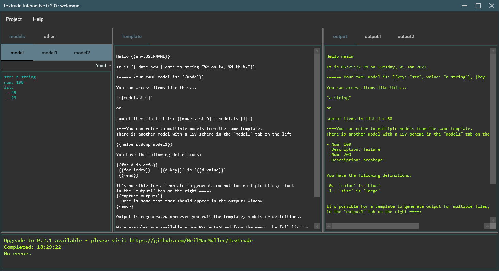

# Textrude

## Give a Star! :star:

If you like or are using this project please give it a star or leave some feedback in the [discussions](https://github.com/NeilMacMullen/Textrude/discussions/categories/send-a-smile) section. A little feedback goes a long way - thanks!

## What is it?

Textrude is a cross-platform general-purpose code-generation tool.  It can easily import data from CSV,YAML, JSON  or plain-text files and apply [Scriban](https://github.com/scriban/scriban) templates to quickly scaffold output files. 

Templates and models can quickly be developed using the bundled TextrudeInteractive tool.

## Why use it?

Let's face it, there are any number of code-generation technologies you might consider.  Textrude's strengths are:

- Easy model (data) creation - use CSV for simple lists or YAML/JSON if you need structured data
- Low-ceremony syntax while retaining a fully functional programming language
- Supports multiple input models and multiple output files for a single template
- Easy to inject additional model context via environment variables or user-supplied definitions
- Built-in dependency checking integrates well with your build system
- Allows template re-use via include mechanism
- Real-time prototyping tool  (TextrudeInteractive)

## Download

Get pre-built binaries from the [Releases](https://github.com/NeilMacMullen/Textrude/releases) area or build yourself from source.

You may need to install [.Net 5.0](https://dotnet.microsoft.com/download/dotnet/5.0) if it is not already on your machine.

The binaries are provided in the form of a zip which includes single-file executables as well as example projects and library scripts. 

## Known issues...
- YAML and CSV deserialisers will always attempt to force strings that look like numbers or booleans into that format rather than leaving them as strings.  Most of the time this does not matter but please raise an issue if this causes particular problems
- TextrudeInteractive does not warn when closing if project is dirty.
- Textrude.exe is untested on Linux - please raise an issue if you run into problems

## Documentation
- [Getting started with template generation](doc/gettingStarted.md) 
- [Built in functions and helpers](doc/builtIns.md)
- [Environment variables and user-definitions](doc/environmentAndDefinitions.md)
- [Multiple models and/or output files](doc/multiModel.md)

- [Creating and using library functions](doc/userlibrary.md)
- [Using Textrude in a build system](doc/buildSystemIntegration.md)

## Credits

Textrude makes heavy use of the following components:
- [Scriban](https://github.com/scriban/scriban) as the template language engine
- [CsvHelper](https://github.com/JoshClose/CsvHelper) for command-line parsing
- [YamlDotNet](https://github.com/aaubry/YamlDotNet) for YAML deserialisation
- [Json.Net](https://www.newtonsoft.com/json) for Json deserialisation
- [Humanizr](https://github.com/Humanizr/Humanizer) for useful text-processing
- [MaterialDesignToolkit](https://github.com/MaterialDesignInXAML/MaterialDesignInXamlToolkit),   [MaterialDesignExtensions](https://spiegelp.github.io/MaterialDesignExtensions) and [Ookii Dialogs](https://github.com/augustoproiete/ookii-dialogs-wpf)to make the UI a bit less clunky
  

## Help wanted 

If you fancy making Textrude better, I'd be happy to have help! Some ideas for improvement...

- UI
    - Change the current scratch code to a more formal MVVM architecture
    - Improve the text-edit boxes to show line numbers, syntax-hightlighting etc (maybe use AvalonEdit?)
    - Intellisense for template editing (we should be able to walk the models and suggest sensible dot completions)
- Documentation and example projects
- Library methods and helpers
  - More library functions for common tasks
  - Suggestions for 3rd party helper packages such as Humanizr
- Distribution
  - Chocolately package?  
- General usage
  - Bug-reporting, real-world usability, Linux testing

## What's with the name 
It's short for Text-extrude but if you can't stop seeing it as Text-Rude you are not alone.

It is unrelated to both the rather cool (but apparently abandoned project) [Textruder](https://github.com/arrogantrobot/textruder) and the plastics company [Tex-Trude](http://www.tex-trude.com/)

