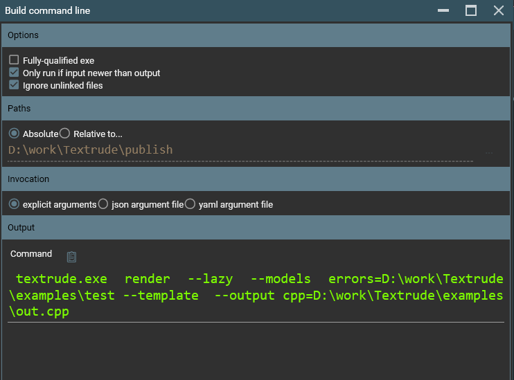

# Exporting a project to the command line

Running the CLI version of Textrude can require you to pass a lot of arguments.  The *Export/Build Command Line Invocation* menu option brings up a dialog which is intended to make this easier.

Note that only [linked files](../doc/fileLinkage.md) are considered when building a command line so you may want to set up links for all the inputs and outputs you are using.

When the dialog is opened, it offers a number of options that can be changed depending on the scenario...

## Fully-qualified exe
If textrude.exe will not be on the path then selecting this option generates a command-line that uses the full path to the executable.

## Only run if input newer than output
If the target command is intended to be used in a build system then selecting this option adds the *lazy* option which causes textrude.exe to skip rendering unless it detects that the input has changed since the last time it ran.

## Ignore unlinked files
By default unlinked files are ignored completely but you can generate stubs for all models and outputs by selecting this option.  Note that the resulting command line **must** be edited by hand before being used.

## Absolute vs Relative paths
If *absolute* is selectd, linked files will be referred to using fully-qualified paths.  If *relative to* is selected, a path relative to the supplied path is generated.  This can be useful when the command line will be run from a directory unrelated to the location that Textrude was installed.

## Explicit arguments
Generates a command that passes explicit arguments to the *render* command

## Json/Yaml argument file
These options marshall the arguments within a parameters file of the specified type the construct a command line that would use it.  

