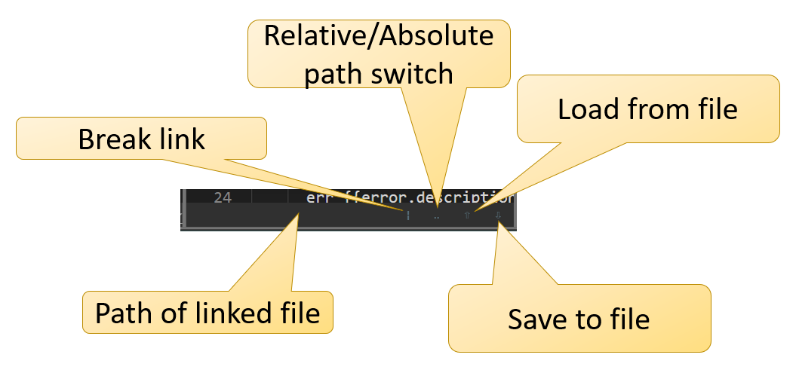

# Links to external files

By default, TextrudeInteractive stores all text within the project file.  However, below each input and output pane is a set of *file linkage* controls which can be used to establish links to files on disk.

A link is established by using either the *load from file* or *save to file* buttons.  From that point the file path will appear in the *path* section.  The file can then be reloaded or saved with a single button press.

Breaking the link can be done with the *break link* button. 

Note that linked files are not automatically reloaded or saved.  You can use the *Inputs/Reload linked* or *Outputs/Save linked* menu items to save multiple inputs or outputs.
