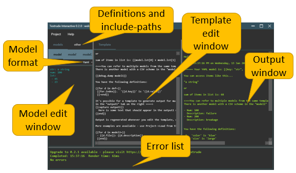

# Getting started

*The easiest way to get started with Textrude and Scriban is to play with TextrudeInteractive but if you want to charge ahead and use the commmand-line tool, refer to the build-system integration documentation*


## Understanding the template flow 
A typical scenario relies on input from:
- one or more *models*.  These are sets of structured data supplied via CSV/YAML/JSON or text files
- environment variables inherited from the current process. 
- a list of user-supplied *definitions*

The input is acted on by a *template* and rendered to one or more output files.

In TextrudeInteractive, the set of inputs along with the *template* is collected together as a *project*.

A simple project demonstrating these features can be loaded from the *examples* folder as *welcome.texproj"


As you type into the template or model windows the output is rendered in real-time.

If you want to use the project from the command-line version for Textrude, select *Project/Export as invocation* and select an empty folder.  All the models and the contents of the template window are saved as files within the folder. A *render.bat* file is created alongside them.  If you run this batch file from a command shell it will invoke Textrude.exe and produce the same output as you see from the interactive tool.  This makes it easy to prototype your templates and models interactively then to export them in a form suitable for use in a build system or non-interactive environment.


## Model types 
A model may be a simple list of objects with the same schema (as with CSV) or a heirarchy of structured objects.  In either case the syntax for accessing an element is similar; the "namespace" for a model is *modelN*  As a convenience the first model is also exposed as *model*.  You can refer to elements within a model by "dotting into" it or using array notation.

### CSV models

CSV models are imported as an array of objects with each column being turned into a property of the object.  So if you have a CSV file with names and addresses, you might get the address in the 2nd row as 
*model[1].address*

### Structured models (YAML/JSON)

YAML and JSON support arbitrarily deep nested structures.  In this case, the property names can be used to dot into the model
*model.devices[1].manufacturer.name*


## Template syntax
In common with most templating languagues, Scriban allows you to mix *code* and *text* so it's important to know how to move from one mode to another.

*Code blocks* are indicated using **{{** and **}}**. A quoted string within a code block is evaluated as the value of the string. So the following two blocks are equivalent...

```
This is a text block and will be emitted as-is

{{# This is a single-multiline code-block where quotes are used to emit strings}}
{{for row in model
  "a line of text"
  row.Name;"=";row.value;";\r\n"
end}}

{{# This is a code block where we revert to text-mode internally}}
{{for row in model}}
  a line of text 
  {{row.Name}}={{row.value}};
{{end}}
```
Depending on the relative amount of code to text and your tolerance for braces or quotes you may prefer one style over the other. 

